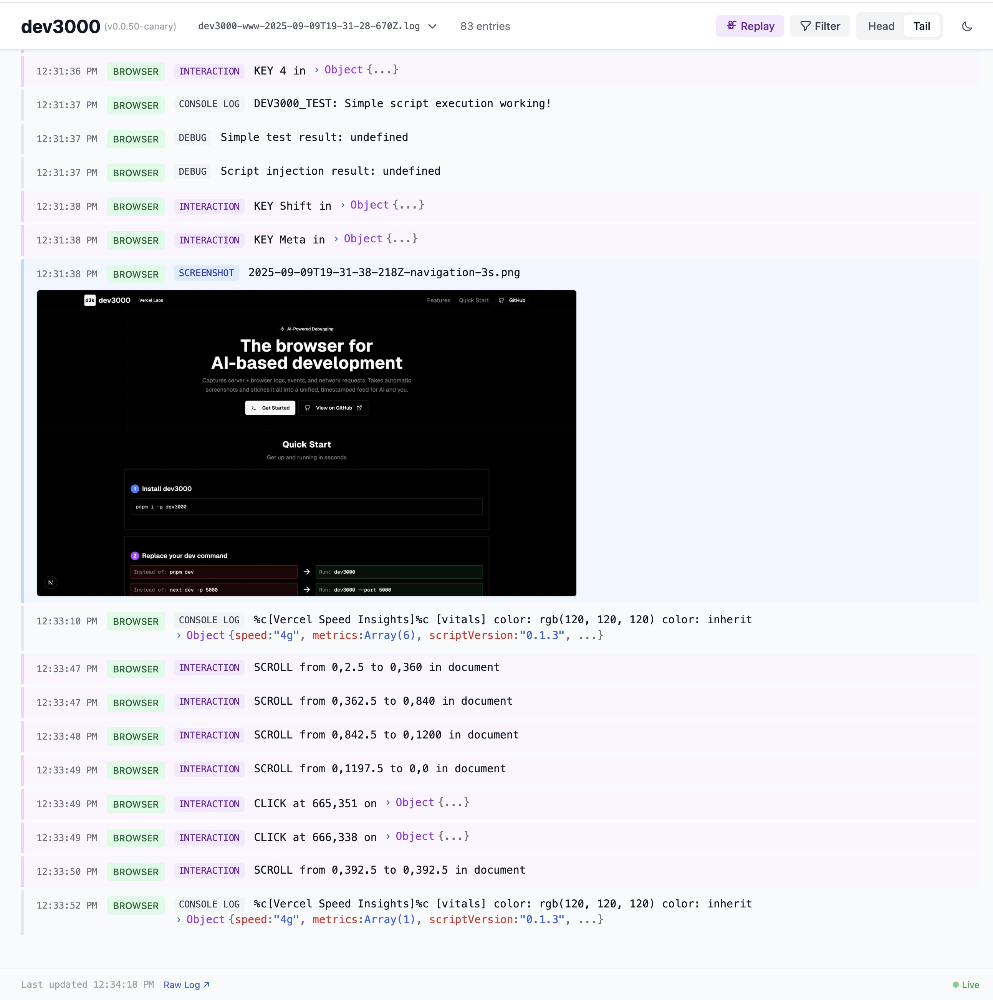

# dev3000

Captures your web app's complete development timeline - server logs, browser events, console messages, network requests, and automatic screenshots - in a unified, timestamped feed for AI debugging.

## Quick Start

```bash
pnpm install -g dev3000
dev3000
```

## AI Integration

**You should connect claude code or any AI tool to the mcp-server to have it issue commands to the browser.**

```bash
claude mcp add -t http -s user dev3000 http://localhost:3684/mcp
```

Then issue the following prompt:

```
Use dev3000 to debug my app
```


## What it does

Creates a comprehensive log of your development session that AI assistants can easily understand. When you have a bug or issue, Claude can see your server output, browser console, network requests, and screenshots all in chronological order.

The tool monitors your app in a real browser and captures:

- Server logs and console output
- Browser console messages and errors
- Network requests and responses
- Automatic screenshots on navigation, errors, and key events
- Visual timeline at `http://localhost:3684/logs`



Logs are automatically saved with timestamps in `/var/log/dev3000/` (or temp directory) and rotated to keep the 10 most recent per project. Each instance has its own timestamped log file displayed when starting dev3000.

### MCP Integration Notes

The MCP server at `http://localhost:3684/mcp` supports the HTTP prototcol (not stdio) as well as the following commands for advanced querying:

- `read_consolidated_logs` - Get recent logs with filtering
- `search_logs` - Regex search with context
- `get_browser_errors` - Extract browser errors by time period
- `execute_browser_action` - Control the browser (click, navigate, screenshot, evaluate, scroll, type)

**Cursor**:

```js
{
  "mcpServers": {
      "dev3000": {
          "type": "http",
          "url": "http://localhost:3684/mcp"
      }
  }
}
```

## Using the Chrome Extension vs Playwright

dev3000 supports two monitoring modes:

### Default: Playwright Browser Automation

By default, dev3000 launches a Playwright-controlled Chrome instance for comprehensive monitoring.

### Alternative: Chrome Extension

For a lighter approach, install the dev3000 Chrome extension to monitor your existing browser session.

#### Installing the Chrome Extension

Since the extension isn't published to the Chrome Web Store, install it locally:

1. Open Chrome and navigate to `chrome://extensions/`
2. Enable "Developer mode" (toggle in top-right corner)
3. Click "Load unpacked"
4. Navigate to your dev3000 installation directory and select the `chrome-extension` folder
5. The extension will now monitor localhost tabs automatically

#### Using with --servers-only

When using the Chrome extension, start dev3000 with the `--servers-only` flag to skip Playwright:

```bash
dev3000 --servers-only
```

#### Comparison

| Feature             | Playwright (Default)     | Chrome Extension        |
| ------------------- | ------------------------ | ----------------------- |
| **Setup**           | Automatic                | Manual install required |
| **Performance**     | Higher resource usage    | Lightweight             |
| **Browser Control** | Full automation support  | Monitoring only         |
| **User Experience** | Separate browser window  | Your existing browser   |
| **Screenshots**     | Automatic on events      | Manual via extension    |
| **Best For**        | Automated testing, CI/CD | Development debugging   |

## Options

```bash
dev3000 [options]

  -p, --port <port>         Your app's port (default: 3000)
  --mcp-port <port>         MCP server port (default: 3684)
  -s, --script <script>     Package.json script to run (default: dev)
  --browser <path>          Full path to browser executable (e.g. Arc, custom Chrome)
  --servers-only            Run servers only, skip browser launch (use with Chrome extension)
  --profile-dir <dir>       Chrome profile directory (default: /tmp/dev3000-chrome-profile)
```

Examples:

```bash
# Custom port
dev3000 --port 5173

# Use Arc browser
dev3000 --browser '/Applications/Arc.app/Contents/MacOS/Arc'

# Use with Chrome extension (no Playwright)
dev3000 --servers-only

# Custom profile directory
dev3000 --profile-dir ./chrome-profile
```

---

_Made by [elsigh](https://github.com/elsigh)_

## Contributing

We welcome contributions! Here's how to get started:

### Testing Your Changes Locally

Use the canary script to build and test your changes on your machine:

```bash
./scripts/canary.sh
```

This will:
- Build the project (including MCP server)
- Create a local package
- Install it globally for testing
- You can verify with `dev3000 --version` (should show canary version)

### Before Submitting a PR

- **Pull the latest changes** from `main`
- **Run the canary build** to test your changes: `./scripts/canary.sh`
- **Ensure tests pass**: `pnpm test`
- **Note**: Pre-commit hooks will automatically format your code with Biome

### Development Tips

- Use `pnpm run lint` to check code style
- Use `pnpm run typecheck` for TypeScript validation
- The canary script is the best way to test the full user experience locally

## Releasing (Maintainers Only)

We use a semi-automated release process that handles testing while accommodating npm's 2FA requirement:

### Option 1: GitHub Actions + Manual Publish (Recommended)

1. Go to [Actions](https://github.com/vercel-labs/dev3000/actions) → "Prepare Release"
2. Select release type (patch/minor/major) and run
3. Wait for tests to pass on all platforms
4. Download the release artifact (tarball)
5. Publish locally: `./scripts/publish.sh dev3000-*.tgz`

### Option 2: Local Release

```bash
./scripts/release.sh  # Creates tag and updates version
./scripts/publish.sh  # Publishes to npm (requires 2FA)
git push origin main --tags
```

The release script automatically handles re-releases by cleaning up existing tags if needed.

For detailed instructions, see [docs/RELEASE_PROCESS.md](docs/RELEASE_PROCESS.md).
